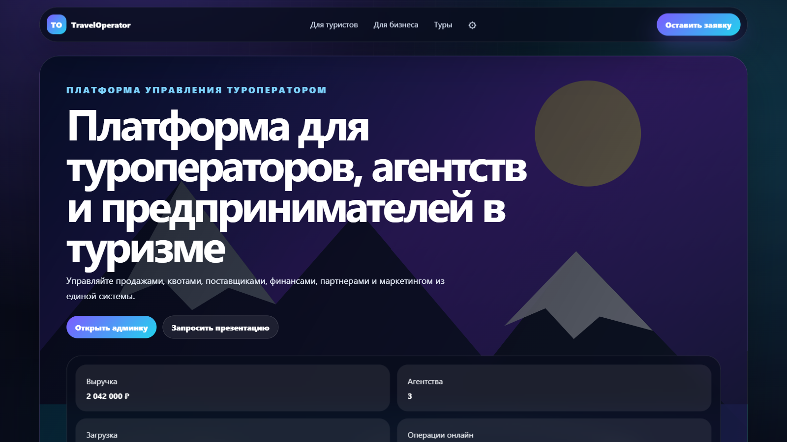
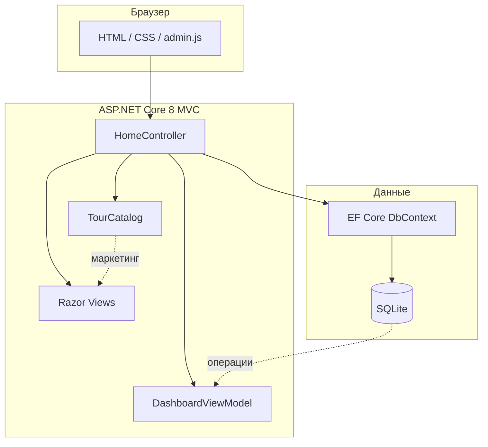

<div align="center">


<br/><br/>

# TravelOperator

**Современная веб-платформа для туристического оператора**  
Витрина туров, B2B-презентация и административная панель в одном приложении.

<br/>

[](https://krammyyds-traveloperator.hf.space)
[](https://dotnet.microsoft.com/)
[](https://learn.microsoft.com/aspnet/core/mvc/)
[](https://learn.microsoft.com/ef/core/)
[](https://www.sqlite.org/)
[](https://www.docker.com/)

<br/>

[Открыть демо](https://krammyyds-traveloperator.hf.space) · [Быстрый старт](#-быстрый-старт) · [Админ-панель](#-админ-панель) · [Деплой](#-деплой)

</div>

---

## О проекте

**TravelOperator** — дипломный проект веб-приложения для автоматизации работы туроператора. Система объединяет публичную витрину, каталог из **9 направлений**, страницу тура с программой по дням и операционную админ-панель с KPI, заявками и финансовыми срезами.

Проект демонстрирует полный цикл: от выбора тура туристом до аналитики для руководителя.

| Роль | Что видит пользователь |
|------|------------------------|
| **Турист** | Главная, каталог, карточка тура, учебная заявка |
| **Предприниматель** | B2B-страница с модулями CRM, финансов и партнёрского портала |
| **Менеджер** | Админ-панель: продажи, туры, операции, финансы |
| **Руководитель** | KPI: выручка, загрузка, свободные места, воронка заявок |

---

## Скриншоты

<table>
  <tr>
    <td width="50%" align="center">
      
      <br/><sub><b>Главная</b> — витрина и поиск направлений</sub>
    </td>
    <td width="50%" align="center">
      
      <br/><sub><b>Каталог</b> — 9 направлений с карточками</sub>
    </td>
  </tr>
  <tr>
    <td width="50%" align="center">
      
      <br/><sub><b>Тур</b> — программа по дням и уникальные фото</sub>
    </td>
    <td width="50%" align="center">
      
      <br/><sub><b>Админка</b> — обзор, метрики и вкладки</sub>
    </td>
  </tr>
</table>

<details>
<summary><b>B2B-страница для бизнеса</b></summary>
<br/>

</details>

---

## Возможности

- **Публичная витрина** с адаптивной вёрсткой и тёмной премиальной темой
- **Каталог из 9 туров**: Байкал, Алтай, Камчатка, Сочи, Грузия, Каппадокия, Дагестан, Карелия, Узбекистан
- **Программа 4–10 дней** с отдельным фото на каждый день (`ProgramImages`)
- **69 локальных фотографий** в `wwwroot/images/tours/` — без внешних CDN
- **Админ-панель** с 6 вкладками: Обзор, Продажи, Туры, Операции, Финансы, Система
- **SQLite + EF Core** с автосозданием БД и демо-данными при старте
- **Сессионная авторизация** администратора с CSRF-защитой
- **Docker** и CI/CD на Hugging Face Spaces

---

## Архитектура



---

## Стек технологий

| Слой | Технологии |
|------|------------|
| Backend | ASP.NET Core 8, MVC, C# 12 |
| Данные | Entity Framework Core, SQLite |
| Frontend | Razor, HTML5, CSS3, Vanilla JS |
| DevOps | Docker, GitHub Actions, Hugging Face Spaces |
| UI | Кастомный CSS без Bootstrap-шаблонов |

---

## Направления в каталоге

| Тур | Дней | Уровень |
|-----|------|---------|
| Байкал: лед и Ольхон | 7 | Комфорт |
| Алтай Adventure | 9 | Активный |
| Камчатка: вулканы | 10 | Экспедиция |
| Сочи для семьи | 8 | Семейный |
| Грузия: вино и горы | 7 | Гастро |
| Каппадокия | 6 | Премиум |
| Дагестан | 6 | Культура |
| Карелия | 4 | Комфорт |
| Узбекистан Silk Road | 8 | Культура |

---

## Быстрый старт

**Требования:** [.NET SDK 8.0](https://dotnet.microsoft.com/download)

```bash
git clone https://github.com/Urazboychik/TravelOperator.git
cd TravelOperator
dotnet restore
dotnet run
```

Откройте в браузере: **http://localhost:5000**

При первом запуске SQLite-база создаётся автоматически и заполняется демо-данными.

---

## Админ-панель

1. На любой публичной странице нажмите **шестерёнку** в шапке
2. Введите пароль:

```
1254
```

3. Откроется `/Home/Admin` с вкладками продаж, туров и аналитики

---

## Структура проекта

```text
TravelOperator/
├── Controllers/           # HomeController — маршруты и логика
├── Data/                  # DbContext, DemoData.Seed
├── Models/                # TourPackage, BookingRequest, TourCatalog
├── Views/                 # Razor: Customer, Offers, Tour, Admin...
├── wwwroot/
│   ├── css/               # site.css, admin.css
│   ├── js/                # admin.js — вкладки, модалки
│   └── images/tours/      # 69 фото туров + thumbs
├── .github/
│   ├── assets/            # Скриншоты и баннер README
│   └── workflows/         # Деплой HF / Render / Fly.io
├── Dockerfile
└── Program.cs
```

---

## Деплой

### Hugging Face Spaces (рекомендуется)

**Live:** [krammyyds-traveloperator.hf.space](https://krammyyds-traveloperator.hf.space)

1. Токен: [huggingface.co/settings/tokens](https://huggingface.co/settings/tokens) (право **write**)
2. GitHub → Settings → Secrets → `HF_TOKEN`
3. Push в `main` или Actions → **Deploy to Hugging Face Space**

### Локальный публичный URL (без регистрации)

```powershell
powershell -ExecutionPolicy Bypass -File .\start-public.ps1
```

Поднимает туннель **localhost.run** — адрес появится в консоли.

### Render / Fly.io

См. workflow-файлы в `.github/workflows/` и `fly.toml`.

---

## Автор

<table>
  <tr>
    <td>
      <b>Шеркулов Уразбой</b><br/>
      Дипломный проект · Разработка веб-приложения для туристического оператора<br/><br/>
      <a href="https://github.com/Urazboychik">GitHub</a> ·
      <a href="https://krammyyds-traveloperator.hf.space">Демо</a>
    </td>
  </tr>
</table>

---

<div align="center">

**Если проект полезен — поставьте звезду на GitHub**

<br/>

[](https://github.com/Urazboychik/TravelOperator/stargazers)

<br/>

<sub>Сделано с ASP.NET Core и любовью к путешествиям</sub>

</div>
